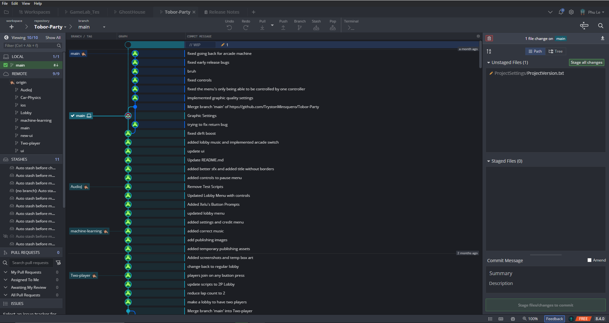
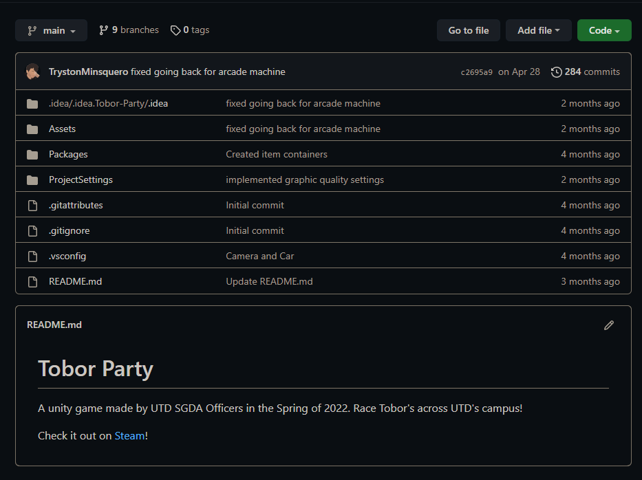

# What is it?

## What is Source Control?


**Source control** (also known as **version control**) is the tracking and managing changes of assets and code in a game


Source control is a way to track your project history and collaborate with others on a team project.

It allows you to store and back up your project files in a remote <mark style="color:blue;">**repo**</mark> through a source control application (ie. Github Desktop, GitKraken).

## What's a Repo

A project repository, or repo, stores all versions of the project files and directories which are usually hosted on Github

