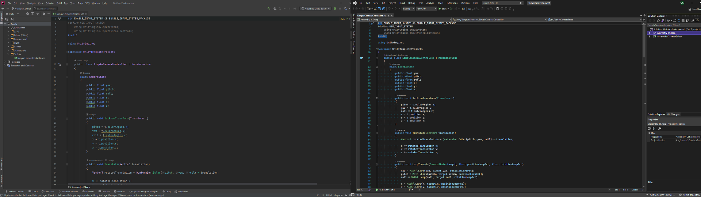

# Overview

This section of the docs contains general information about contributing to the game and guides for specific systems. Please see the API documentation for more detailed write ups for code within this project.

## Code Style

In pre-existing files, the original code style takes precedent; mimic the same style and DO NOT reformat the entire file to your own style. This keeps commit history more concise.

Although an offical style is not defined. PLEASE favor readibility and organization, include comments for your intent that a piece code has, and do not leave dead code. Also document public facing methods by typing `///` above a method's definition. IDE's like Visual Studio and Rider will automatically generate the xml documentation boilerplate.

```csharp
/// <summary>
/// The purpose of this function and notes related to its usage.
/// </summary>
/// <param name="obj"> what is this parameter </param>
public void ExampleMethod(Object obj)
{
    // ...
}
```

## Namespaces

USE THEM! In most cases, you will want to include your classes in a sub-namespace of one the two: `Game` and `Utility`.

- `Utility` should be used for more generic tools or systems that perhaps not specific to this project, such as an audio system or `PropertyAttribute`s.
- `Game` should contain code related to this game, including player, ui, etc. related scripts.

```csharp
namespace Game.Player
{
    public class PlayerController : MonoBehaviour
    {
        //...
    }
}
```

## IDE

Feel free to use whatever IDE you would like. Visual Studio and Jetbrain's Rider are 2 of the most popular options. They include much stronger code completion than a text editor like Visual Studio Code (even with plugins). Visual Studio is free and students can get an educational license for Rider.

