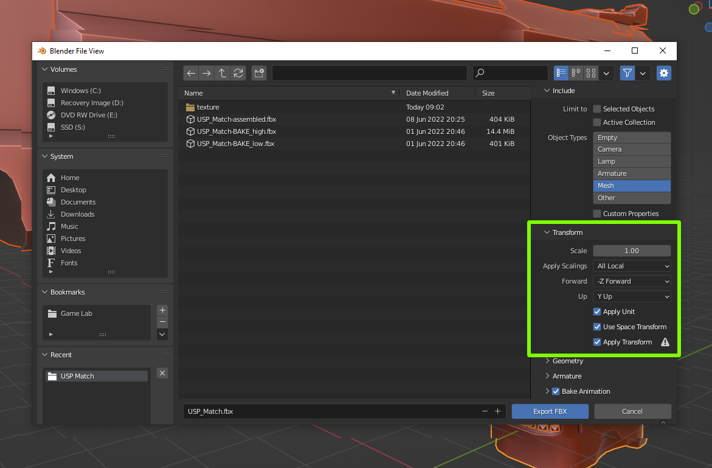

# Blender

## Scale & Rotation

Before exporting, select all mesh of the model and apply **Scale** and **Rotation:**


Shortcut: <mark style="color:yellow;">Ctrl + A</mark>


## Set Origin

place holder

## Export Settings

During export, match the **Transform** settings below:


Remember to tick the <mark style="color:yellow;">**"Apply Transform"**</mark> check box - otherwise the scale and rotation values won't transfer correctly into Unity

